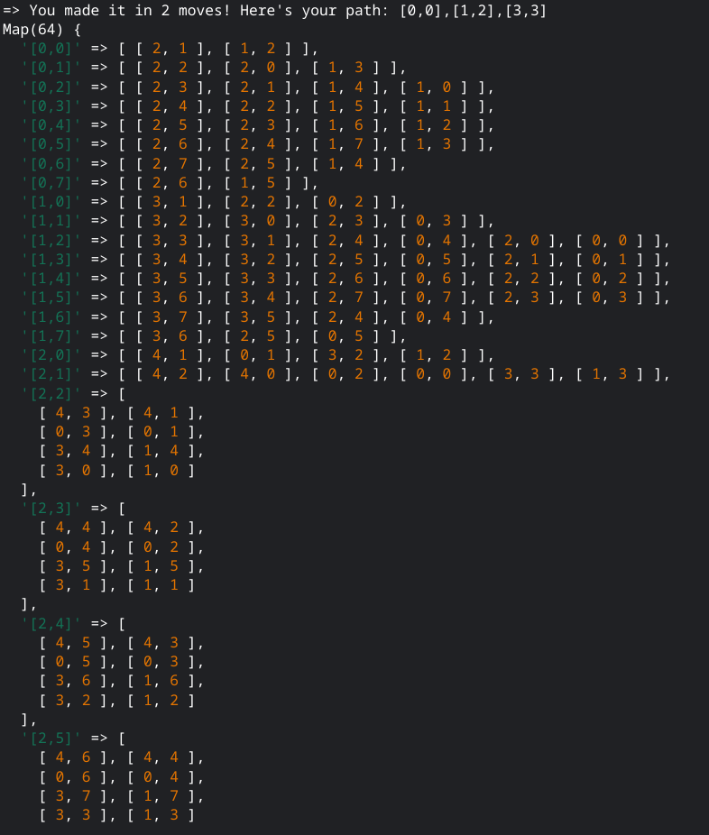

# Odin Project Knights Travails

[Odin Project Directions](https://www.theodinproject.com/lessons/javascript-knights-travails)

## Table of Contents

- [Screenshot](#screenshot)
- [How to use](#how-to-use)
- [Thoughts](#thoughts)
- [Useful Resources](#useful-resources)
- [Acknowledgements](#acknowledgements)

## Screenshot



## How To Use

To clone and run this application, you'll need [Git](https://git-scm.com) and [Node.js](https://nodejs.org/en/download/) (which comes with [npm](http://npmjs.com)) installed on your computer. From your command line:

```bash
# Clone this repository
$ git clone https://jdegand.github.io/odin-project-knights-travails

# Change into the directory
$ cd odin-project-knights-travails

# Run the script
$ node knights-travails

```

## Thoughts

- I looked at a lot of variations of this problem and it didn't help as much as I thought it would. 
- BFS loops a lot more times than you would think even with a visited array. BFS eventually reaches a point where it becomes extremely slow. (multidimensional cubes) 
- BFS is level order
- Creating an adjacency list for all positions creates a lot of wasted work -  can find minimum path without it
- Need to use a set for the visited positions and a map for the adjacency list.  
- Sets need to evaluate coordinates as strings
- A set needs to be initialized with an array
- Getting the path is harder than getting the amount of steps
- Shift() has a time complexity of O(n)
- Could clean up knight-travails file with imports
- Could try to make solution like khan example where adjacencyList is one of the arguments of the main function 

## Useful Resources

- [Khan Academy](https://www.khanacademy.org/computing/computer-science/algorithms/graph-representation/a/describing-graphs) - describing graphs
- [Runestone Academy](https://runestone.academy/ns/books/published/cppds/Graphs/BuildingtheKnightsTourGraph.htmlRe) - knights tour graph
- [MindBluff](https://mindbluff.com/askchess.htm) - knights tour game
- [Rosetta Code](https://rosettacode.org/wiki/Knight%27s_tour#JavaScript) - knights tour
- [YouTube](https://www.youtube.com/watch?v=D8KFwjohDNg) - Knights Tour
- [YouTube](https://www.youtube.com/watch?v=Ntoyq5TinD8) - python knights tour
- [YouTube](https://www.youtube.com/watch?v=vrfIkyKEhKs) - c# knights tour
- [Appsloveworld](https://www.appsloveworld.com/ruby/100/118/knights-travails-and-binary-search-tree) - knights travails and binary search tree
- [Medium](https://levelup.gitconnected.com/finding-the-shortest-path-in-javascript-dijkstras-algorithm-8d16451eea34) - dijkstra's algorithm
- [YouTube](https://www.youtube.com/watch?v=cWNEl4HE2OE) - Graphs JS
- [Github](https://github.com/CrazyReborn/hamilton-canvas/blob/main/scripts/algorithms/Dijkstras.js) - Dijkstra js
- [YouTube](https://www.youtube.com/watch?v=KiCBXu4P-2Y) - bfs shortest path
- [Github](https://github.com/trekhleb/javascript-algorithms/blob/master/src/algorithms/graph/dijkstra/dijkstra.js) - Dijkstra js
- [YouTube](https://www.youtube.com/watch?v=4SjxUqG2WZU) - leetcode
- [YouTube](https://www.youtube.com/watch?v=MjFjmwLbrk8) - minimum knight moves
- [YouTube](https://www.youtube.com/watch?v=EAENzLxAVhw) - minimum knight moves js
- [Github](https://github.com/JSerZANP/leetCode_solutions/blob/main/1197-minimum-knight-moves.md) - minimum knight moves
- [YouTube](https://www.youtube.com/watch?v=lKwvVsI9r94) - minimum knight moves js
- [Blog](https://unicorn-utterances.com/posts/chess-knight-problem) - chess knight problem vanilla js
- [Stack Overflow](https://stackoverflow.com/questions/59903334/need-help-to-create-a-breadth-first-search-function) - ruby
- [OneCompiler](https://onecompiler.com/javascript/3x6uxmnwf) - knight bfs
- [Javascript.info](https://javascript.info/map-set) - map & set
- [YouTube](https://www.youtube.com/watch?v=AXnbC3zbnL4) - Adjacency List
- [Stack Overflow](https://stackoverflow.com/questions/48411581/how-to-avoid-for-loop-inside-for-loop-in-javascript) - avoid nested for loops
- [YouTube](https://www.youtube.com/watch?v=jzBJhK8GbEI) - coding bfs
- [Adiran Mejia](https://adrianmejia.com/data-structures-for-beginners-graphs-time-complexity-tutorial/) - data structures graphs
- [Adiran Mejia](https://adrianmejia.com/how-to-solve-any-graph-2d-arrays-maze-interview-questions-in-javascript-dfs-vs-bfs/) - bfs vs dfs
- [Dimitri Pavlutin](https://dmitripavlutin.com/javascript-queue/) - JS Queue
- [Replit](https://replit.com/@Codevolution/JavaScript-Data-Structures#queue-object.js) - Codevolution JS Data Structures
- [Geeks for Geeks](https://www.geeksforgeeks.org/reversing-a-queue/) - reversing a queue

## Acknowledgements

- [TruePadawan](https://github.com/TruePadawan/Knight-Travails) - one of the best solutions I looked at.  My solution is a tweaked version that could be improved even further.